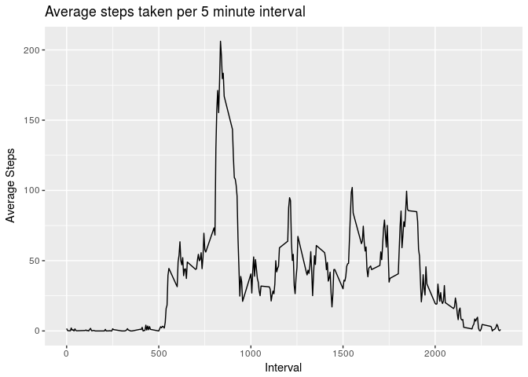

# Reproducible Research: Peer Assessment 1


## Loading and preprocessing the data

### 1. Code for reading in the dataset and/or processing the data


```r
setwd('~/git/RepData_PeerAssessment1')
rm(list=ls())

# Libraries
library(ggplot2)
library(dplyr)
```

```
## 
## Attaching package: 'dplyr'
```

```
## The following objects are masked from 'package:stats':
## 
##     filter, lag
```

```
## The following objects are masked from 'package:base':
## 
##     intersect, setdiff, setequal, union
```

```r
library(lubridate)
```

```
## 
## Attaching package: 'lubridate'
```

```
## The following object is masked from 'package:base':
## 
##     date
```

```r
# 1. Load data
activity <- read.csv('activity.csv')
# Set Date to be a date object
activity <- activity %>%
  mutate( date=as.Date(date) )
```

### 2. Histogram of the total number of steps taken each day


```r
# 2. Plot histogram of the number of steps each day
g <- ggplot( data=activity, aes(date,steps) )
g + geom_bar( stat="sum" ) + labs( title="Steps taken each day", x="Date", y="Steps" )
```

```
## Warning: Removed 2304 rows containing non-finite values (stat_sum).
```

<!-- -->
  


## What is mean total number of steps taken per day?


```r
# 3. Get mean and median of steps each day (across 5 minute intervals)
activity.means <- activity %>%
  filter( !is.na(steps) ) %>%
  group_by( date ) %>%
  summarize( mean.steps=mean(steps), median.steps=median(steps) )

print(activity.means)
```

```
## # A tibble: 53 x 3
##          date mean.steps median.steps
##        <date>      <dbl>        <dbl>
##  1 2012-10-02    0.43750            0
##  2 2012-10-03   39.41667            0
##  3 2012-10-04   42.06944            0
##  4 2012-10-05   46.15972            0
##  5 2012-10-06   53.54167            0
##  6 2012-10-07   38.24653            0
##  7 2012-10-09   44.48264            0
##  8 2012-10-10   34.37500            0
##  9 2012-10-11   35.77778            0
## 10 2012-10-12   60.35417            0
## # ... with 43 more rows
```


## What is the average daily activity pattern?

### 4. Time series plot of the average number of steps taken


```r
# 4. Plot the average steps per day for a 5 minute interval
g <- ggplot( data=activity.means, aes(date,mean.steps) )
g + geom_line() + labs( title="Average steps taken each day during a 5 minute period", x="Date", y="Average Steps" )
```

<!-- -->
  
  
### 5. The 5-minute interval that, on average, contains the maximum number of steps

```r
# 5. The 5-minute interval that, on average, contains the maximum number of steps
activity.interval.means <- activity %>%
  filter(!is.na(steps)) %>%
  group_by(interval) %>%
  summarize( mean.steps=mean(steps) )

activity.interval.max <- activity.interval.means %>%
  filter( mean.steps==max(mean.steps) )
  

print('Interval With the maximum average number of steps')
```

```
## [1] "Interval With the maximum average number of steps"
```

```r
print(activity.interval.max$interval)
```

```
## [1] 835
```


## Imputing missing values


### 6. Code to describe and show a strategy for imputing missing data


```r
# lookup- missing values
activity.missing.vals <- activity %>%
  filter(is.na(steps))


# * Mean: the mean of the observed values for that variable
#    We can use the mean data points from either interval or from date
#    We cannot use the mean data points from the date as only a fraction of dates have missing values.
#    We will use the mean data poiints from interval as this gives a better sample.

# Convert interval means to a named numeric that we can lookup
int.m <- activity.interval.means$mean.steps
names(int.m) <- activity.interval.means$interval

# Fill in the empty steps with the mean
activity[is.na(activity$steps),'steps'] <- int.m[as.character(activity[is.na(activity$steps),'interval'])] 
```


### 7. Histogram of the total number of steps taken each day after missing values are imputed


```r
# 7. Histogram of the total number of steps taken each day after missing values are imputed
g <- ggplot( data=activity, aes(date,steps) )
g + geom_bar( stat="sum" ) + labs( title="Steps taken each day (after imputing)", x="Date", y="Steps" )
```

<!-- -->


## Are there differences in activity patterns between weekdays and weekends?


### 8. Panel plot comparing the average number of steps taken per 5-minute interval across weekdays and weekends


```r
# 8. Add a weekday/weekend label to activity.interval.means
weekdays <- c('Mon','Tue','Wed','Thu','Fri')
activity <- activity %>%
  mutate ( wday = lubridate::wday(date,label=TRUE) ) %>%
  mutate ( wday.wend = ifelse( wday %in% weekdays, 'weekday', 'weekend' ) )

# The 5-minute interval that, on average, contains the maximum number of steps
activity.interval.means <- activity %>%
  group_by(interval,wday.wend) %>%
  summarize( mean.steps=mean(steps) )

g <- ggplot( data=activity.interval.means, aes(interval,mean.steps) )
g + geom_bar( stat="sum" ) + 
  facet_grid(.~wday.wend) +
  labs( title="Average Steps taken each Interval\nWeekday vs Weekend", x="Interval", y="Steps" )
```

<!-- -->
