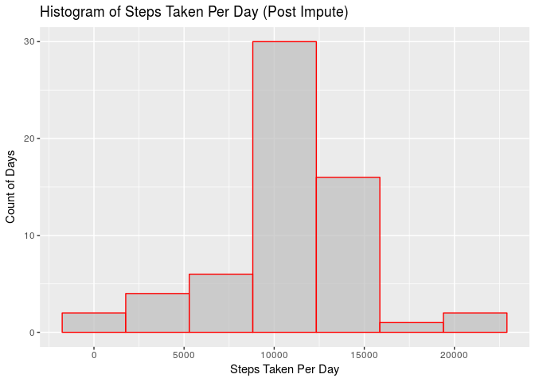

# Reproducible Research: Peer Assessment 1


## Loading and preprocessing the data

### 1. Code for reading in the dataset and/or processing the data


```r
setwd('~/git/RepData_PeerAssessment1')
rm(list=ls())

options(scipen=999)
options(digits=2)

# Libraries
library(ggplot2)
library(dplyr)
library(lubridate)

# 1. Load data
activity <- read.csv('activity.csv')


# Add the wday and wday wend variables
weekdays <- c('Mon','Tue','Wed','Thu','Fri')

# Set Date to be a date object
activity <- activity %>%
  mutate ( date=as.Date(date) )


# Transform data to represent steps taken per day : (ignoring NAs)
activity.steps.per.day <- activity %>%
  group_by(date) %>%
  summarize(steps=sum(steps,na.rm=TRUE))


# Transform data to represent average steps taken per interval : (ignoring NAs)
activity.interval.mean.steps <- activity %>%
  group_by(interval) %>%
  summarize(steps=mean(steps,na.rm=TRUE))
```

### 2. Histogram of the total number of steps taken each day


```r
# 2. Plot histogram of the number of steps each day
nbins <- nclass.FD(activity.steps.per.day$steps)
g <- ggplot( data=activity.steps.per.day, aes(steps) )
g + geom_histogram( col="red", fill="grey", alpha=.7, bins=nbins ) +
    labs( title="Histogram of Steps Taken Per Day", x="Steps Taken Per Day", y="Count of Days") +
    scale_y_continuous(labels = scales::comma)
```

<!-- -->
  


## What is mean total number of steps taken per day?


```r
# 3. Get mean and median of steps each day
mean.steps <- mean(activity.steps.per.day$steps)
median.steps <- median(activity.steps.per.day$steps)
```

Mean Steps Taken per Day : 9354.23  
Median Steps Taken Per Day : 10395  


## What is the average daily activity pattern?

### 4. Time series plot of the average number of steps taken


```r
# Get a list of activity means

# 4. Plot the average steps per day for a 5 minute interval
g <- ggplot( data=activity.interval.mean.steps, aes(interval,steps) )
g + geom_line() + labs( title="Average steps taken per 5 minute interval", x="Interval", y="Average Steps" )
```

<!-- -->
  
  
### 5. The 5-minute interval that, on average, contains the maximum number of steps

```r
# 5. The 5-minute interval that, on average, contains the maximum number of steps
activity.interval.max.avg <- activity.interval.mean.steps %>%
  slice(which.max(steps))
```
Interval With the maximum average number of steps : 835


## Imputing missing values


### 6. Code to describe and show a strategy for imputing missing data


```r
# Calculate and report the total number of missing values in the dataset (i.e. the total number of rows with 
                                                                        
# lookup- missing values
activity.missing.vals <- activity %>%
  filter(is.na(steps))

# Calculate the number of NA Rows
na.count <- nrow(activity.missing.vals)


# * Mean: the mean of the observed values for that variable
#    We will use the mean data poiints from interval

# Convert interval means to a named numeric that we can lookup
int.m <- activity.interval.mean.steps$steps
names(int.m) <- activity.interval.mean.steps$interval

# Fill in the empty steps with the mean from same interval
activity.new <- activity
activity.new[is.na(activity$steps),'steps'] <- int.m[as.character(activity[is.na(activity$steps),'interval'])] 

# Transform data to represent steps taken per day : (ignoring NAs)
activity.steps.per.day.new <- activity.new %>%
  group_by(date) %>%
  summarize(steps=sum(steps,na.rm=TRUE))
```
Number of rows with missing step count : 2304

### 7. Histogram of the total number of steps taken each day after missing values are imputed


```r
# 2. Plot histogram of the number of steps each day
nbins <- nclass.FD(activity.steps.per.day$steps)
g <- ggplot( data=activity.steps.per.day.new, aes(steps) )
g + geom_histogram( col="red", fill="grey", alpha=.7, bins=nbins ) +
    labs( title="Histogram of Steps Taken Per Day (Post Impute)", x="Steps Taken Per Day", y="Count of Days") +
    scale_y_continuous(labels = scales::comma)
```

<!-- -->


```r
# Calculate and report the mean and median total number of steps taken per day.

# 3. Get mean and median of steps each day
mean.steps.new <- mean(activity.steps.per.day.new$steps)
median.steps.new <- median(activity.steps.per.day.new$steps)
```


### Pre-Impute Values
Mean Steps Taken per Day : 9354.23  
Median Steps Taken Per Day : 10395  

### Post-Impute Values
Mean Steps Taken per Day : 10766.19  
Median Steps Taken Per Day : 10766.19  


<!-- Do these values differ from the estimates from the first part of the assignment? -->
Both the mean and median values have increased from the pre-impute values  

<!-- What is the impact of imputing missing data on the estimates of the total daily number of steps? -->
The post-impute values of mean and median are both identical  


## Are there differences in activity patterns between weekdays and weekends?


### 8. Panel plot comparing the average number of steps taken per 5-minute interval across weekdays and weekends


```r
# 8. Add a weekday/weekend label to activity.interval.means
weekdays <- c('Mon','Tue','Wed','Thu','Fri')
activity.new <- activity.new %>%
  mutate ( wday = lubridate::wday(date,label=TRUE) ) %>%
  mutate ( wday.wend = factor(ifelse( wday %in% weekdays, 'weekday', 'weekend' )) )

# The 5-minute interval that, on average, contains the maximum number of steps
activity.interval.means <- activity.new %>%
  group_by(interval,wday.wend) %>%
  summarize( mean.steps=mean(steps,na.rm=TRUE) )

g <- ggplot( data=activity.interval.means, aes(interval,mean.steps) )
g + geom_bar( stat="sum" ) + 
  facet_grid(.~wday.wend) +
  labs( title="Average Steps taken each Interval\nWeekday vs Weekend", x="Interval", y="Steps" ) +
  theme(legend.position="none")
```

<!-- -->
